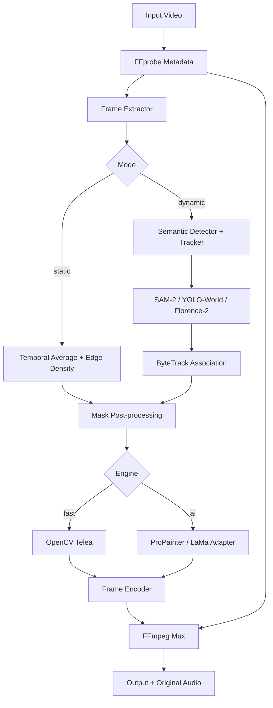

# Omni-Video-Watermark-Remover

Production-oriented open-source video watermark detection/removal pipeline for authorized media. Supports static overlays and an adapter architecture for dynamic overlays.

> Use only on media you own or are authorized to modify. This project does not bypass DRM or access controls.

## Architecture


## Layout
```text
src/omni_watermark/{detector.py,inpainter.py,pipeline.py,cli.py}
models/
configs/{static.yaml,dynamic.yaml}
scripts/
tests/
Dockerfile
pyproject.toml
requirements.txt
```

## Install
```bash
conda create -n omni-watermark python=3.11 -y
conda activate omni-watermark
pip install -r requirements.txt
pip install -e .
```

Docker:
```bash
docker build -t omni-watermark .
docker run --rm --gpus all -v "$PWD:/workspace" omni-watermark --input /workspace/input.mp4 --output /workspace/output.mp4 --mode static --engine fast --gpu-id 0
```

## CLI
```bash
omni-watermark --input input.mp4 --output output.mp4 --mode static --engine fast
omni-watermark --input input.mp4 --output output.mp4 --mode dynamic --engine ai --gpu-id 0
```

Options include `--batch-size`, `--sample-rate`, `--mask-dilate`, `--telea-radius`, `--device`, `--work-dir`, and `--keep-temp`.

## AI backend policy
Heavy model checkpoints are not committed or silently downloaded. SAM-2, YOLO-World, Florence-2, ByteTrack, ProPainter and LaMa have different upstream APIs/checkpoint licenses, so the code exposes explicit adapter contracts.

## Tests
```bash
pytest -q
```

## License
MIT. Third-party model projects/checkpoints retain their own licenses.
